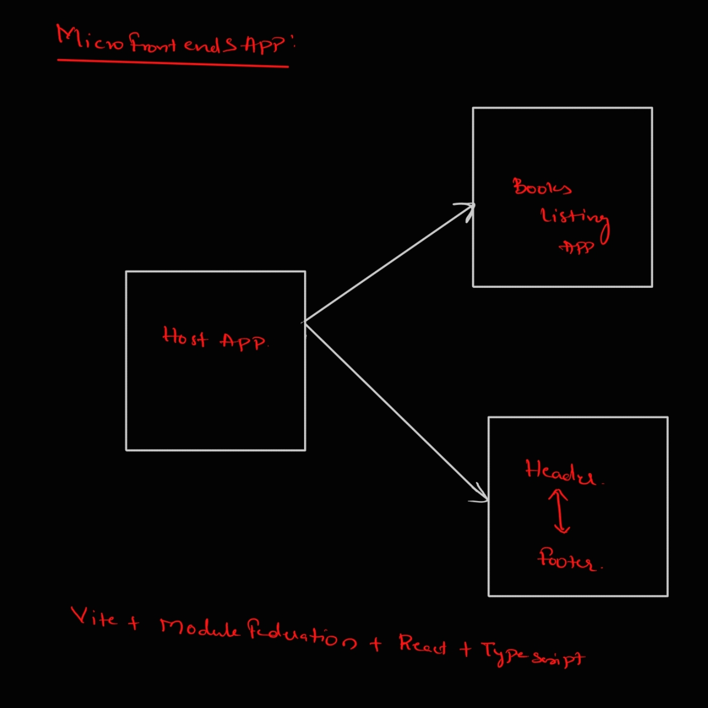

## Start app

### Layout App
    cd layout
    npm install
    npm run build && npm run preview

### Books App
    cd books-app
    npm install
    npm run build && npm run preview

### Host App
    cd host
    npm install
    npm run build && npm run preview